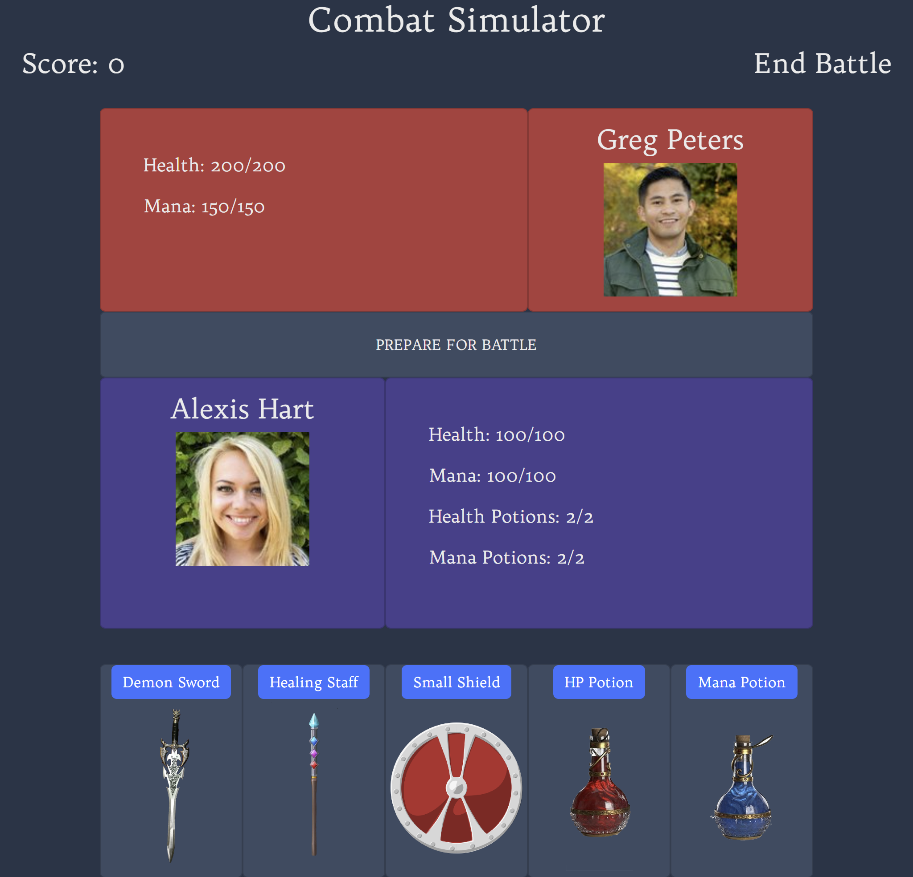

# Combat Simulator

## Table of Content
1. [Description](#description)
2. [Technology Used](#technology-used)
3. [Visuals](#visuals)
4. [Future Development](#future-developments)
5. [Credits](#credits)
 
 

## Description
[Combat Simulator](https://christian-hoffman.github.io/combat-simulator/) \
Combat simulator is a turn based game where the player and enemy ai take turns using either their sword, staff, or shield. The player also has 2 health and 2 mana potions. You will choose between 3 tiers of each weapon, no tier can be picked more than once. Each round you will be fighting against a randomly generated ai that has a higher health and mana pool than you. Every time you defeat an enemy a new one will take their place until you have been defeated. After you are defeated you will find yourself at your death screen. A peaceful quote will allow you to reflect after your journey. You fought hard and well, good luck on your next journey.
 
 

## Technology Used
[Bootstrap v5.2](https://getbootstrap.com/docs/5.2/getting-started/introduction/) \
[Random User Generator API](https://randomuser.me/api/?results=1) \
[Random Quotes API](https://api.quotable.io/random) \
[Google Fonts](https://fonts.google.com/)
 
 

## Visuals

 
 

## Future Developments
Adding enemy scaling and progression throughout the game \
Using open weather api to check the weather in the local area and putting that in the game \
Character creation screen \
In game shop to either upgrade weapons or change them \
Sound Effects \
HighScores 
 
 

## Credits
[Christian Hoffman](https://github.com/Christian-Hoffman) \
[Jacob Lockhart](https://github.com/Revilite) \
[Andrew Powers](https://github.com/APowers9) \
[Grant Finnie](https://github.com/gfinnie01) 